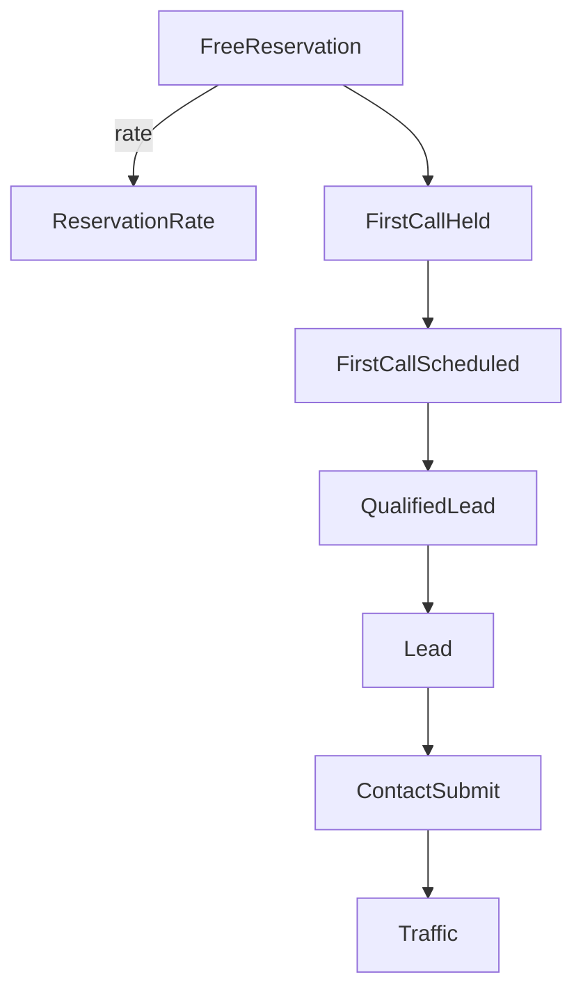

# KPIツリー（ホテルAI：無料先行予約3件）

## 北極星（North Star）

- **ホテルAI：無料先行予約数**（3ヶ月合計）: 3件

## 定義（重要）

- 「無料先行予約」の判定は `06_pipeline/PIPELINE_DEFINITION.md` に従う
- KPIの名称・計測方法は `03_kpi/KPI_DICTIONARY.md` に従う
- 対象: **ホテルAI（入口: 客室AIコンシェルジュ / ターゲット: 小規模ホテル）**

## KPIツリー（構造）

## 数式（分解）

### 1) 予約（結果）

- FreeReservation = 目標 3（3ヶ月）

### 2) 予約の手前（商談）

- ReservationRate = FreeReservation / FirstCallHeld
- FirstCallShowRate = FirstCallHeld / FirstCallScheduled
- FirstCallScheduleRate = FirstCallScheduled / QualifiedLead

### 3) リード

- QualifiedLeadRate = QualifiedLead / Lead
- Lead = サイト/紹介/提携/アウトバウンドで獲得した「連絡可能な見込み顧客」

### 4) トップ・オブ・ファネル（入口）

- ContactSubmit = 問い合わせ送信数（フォーム送信）
- DiagnosisComplete = 診断完了数（任意: 計測できる場合）
- Traffic = セッション/閲覧数（任意: 計測できる場合）

## 逆算（初期の仮置き）

数値は初期仮置きです。運用開始後に実測で更新します。

- 仮定A: ReservationRate 25%
- 仮定B: FirstCallShowRate 80%
- 仮定C: FirstCallScheduleRate 50%
- 仮定D: QualifiedLeadRate 40%

このとき必要量は概算で以下です。

| 指標 | 目標 | 目安（仮定に基づく） |
|---|---:|---:|
| FreeReservation（3ヶ月） | 3 | 3 |
| FirstCallHeld（3ヶ月） | - | 12 |
| FirstCallScheduled（3ヶ月） | - | 15 |
| QualifiedLead（3ヶ月） | - | 30 |
| Lead（3ヶ月） | - | 75 |

※ 週次で見る場合は「12週間」で割って目安を作る（例: Lead 6〜7件/週）。

## 週次の優先（行動KPI）

結果KPI（予約）が増えない週でも、次の行動KPIが増えていれば前進している。

- 接触数（紹介依頼/提携打診/アウトバウンド）
- 商談打診数
- 実験数（コピー/導線/オファー/資料）
- コンテンツ出力（記事/事例/提案資料）

