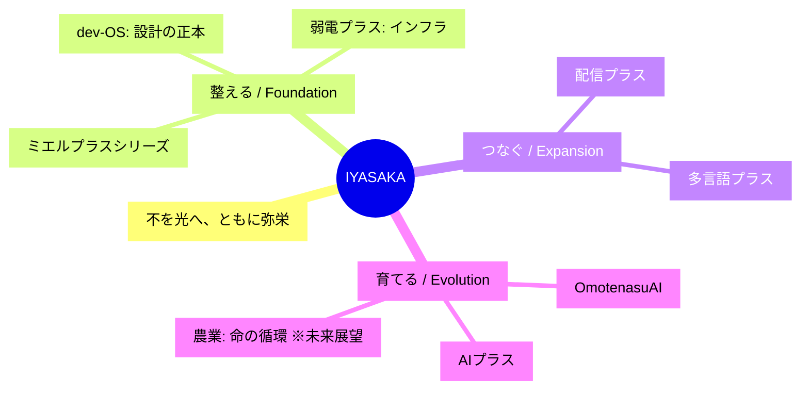

# IYASAKA ブランド・マスター・プロトコル

> 有限会社IYASAKAの全プロジェクト、および開発に携わる全てのAIエディタ（Cursor等）へ共有するための「マスター・ブランド・ドキュメント」。
> このドキュメントを各プロダクトの指示書として読み込ませることで、個別の開発が「IYASAKA」という一つの大きな物語（ナラティブ）へと収束し、ブランドとしての強固な一貫性を生み出します。

---

## 1. 企業理念：IYASAKAの魂

IYASAKAは、単なるIT企業ではありません。私たちは、現場に潜む「不」を「光」へと変換し、関わるすべての人・地域が共に繁栄する「弥栄（いやさか）」の循環を実装するチームです。

### ミッション

**今ある「不」を、未来の「光」へ。**

### コア・バリュー

| バリュー | 説明 |
|---------|------|
| **現場第一主義** | 綺麗なコードやスペックよりも、現場の「溜息」を消すことを優先する |
| **プラスの精神** | 既存の努力や歴史を否定せず、そこに技術を「プラス」して価値を最大化する |
| **弥栄の循環** | 一社勝ちではなく、顧客、その先の利用者、地域社会が等しく潤う仕組みを設計する |

---

## 2. ナラティブOS：3つの変換動詞

IYASAKAの全ての事業は、以下の3つのフェーズのいずれか、あるいは複数を担当します。

### ① 【整える】 - Foundation（基盤）

| 項目 | 内容 |
|------|------|
| **対象** | 弱電プラス、ミエルプラス、**dev-OS** |
| **不** | 不透明、不安、不信、属人化、設計の破綻 |
| **光** | 確信、可視化、安心、再現性 |
| **役割** | 現場の足元と、知恵の土台（設計）を整え、挑戦できる状態を創る |

### ② 【つなぐ】 - Expansion（拡張）

| 項目 | 内容 |
|------|------|
| **対象** | 配信プラス、多言語プラス |
| **不** | 分断、孤立、伝わらない、距離の壁 |
| **光** | 接続、共鳴、多言語、グローバル、体験の共有 |
| **役割** | 閉ざされていた価値を外部や世界と接続し、可能性を拡張する |

### ③ 【育てる】 - Evolution（進化）

| 項目 | 内容 |
|------|------|
| **対象** | OmotenasuAI、AIプラス、（未来の）農業 |
| **不** | 一過性、形骸化、余裕の欠如、未来への不安 |
| **光** | 循環、学習、共創、持続可能性、ゆとり |
| **役割** | 導入して終わりにせず、運用を通じて文化を育て、次世代へ続く循環を創る |

---

## 3. プロダクト・ポートフォリオと物語の型

各AIは、自らが担当する製品が以下のどの文脈にあるかを理解し、UXやコピーを生成してください。

| プロダクト | カテゴリ | ターゲットの「痛み（不）」 | 提供する「情景（光）」 |
|-----------|---------|--------------------------|----------------------|
| **dev-OS** | 基盤・設計 | AI開発のブラックボックス化、設計の破綻 | **「確信」** を持てるAIエンジニアチーム化 |
| **弱電プラス** | 基盤・インフラ | ネットワーク・機器トラブルの孤独な不安 | **「安堵」** 止まらないインフラと伴走者 |
| **ミエルプラス** | 基盤・可視化 | 在庫、予定、車両管理の散らかり | **「透明」** 探す時間が消え、対話が増える現場 |
| **配信プラス** | 拡張・接続 | リソース不足による発信チャンスの損失 | **「共鳴」** あらゆる場所がメディアになる |
| **多言語プラス** | 拡張・接続 | 言葉の壁による機会損失とコスト | **「無境界」** 想いがそのまま世界へ届く |
| **OmotenasuAI** | 進化・循環 | フロント業務の逼迫と接客の画一化 | **「至福」** データに基づいた究極の個客体験 |
| **AIプラス** | 進化・伴走 | ツールが定着しない、使いこなせない | **「共創」** AIが血肉化し、自走する組織 |

---

## 4. 体系図：IYASAKA ナラティブ・ツリー



---

## 5. 開発・コミュニケーション・ガイドライン（全AI共通）

### UI/UXの原則

| 原則 | 説明 |
|------|------|
| **「プラス」のUI** | 既存のワークフローを破壊せず、自然に寄り添うツールであること |
| **「ミエル」の視覚化** | ユーザーが「今どうなっているか」を一目で確信できるダッシュボードを優先する |
| **dev-OS準拠** | すべてのAI製品は、dev-OSの多重監査とSSOT（仕様正本）に基づき、高いガバナンスと品質を維持すること |

### ライティングの原則

#### 専門用語を「体温」に変換

| ❌ 避ける | ⭕ 推奨 |
|----------|--------|
| データベースを更新しました | 現場の知恵を蓄積しました |
| システムエラーが発生 | お手数をおかけします。すぐに確認します |
| 最適化されました | より快適になりました |

#### 問い合わせの一本化

- 全ての製品問い合わせは、公式サイト（`/contact?product=xxx`）へ誘導する
- 「単体のツール」ではなく「IYASAKAというパートナー」への入り口として機能させる

### 未来への布石（農業ビジョン）

IYASAKAの効率化の先には、常に「余白の創出」がある。その余白が最終的に「農業・食・命の循環」へと還元されるビジョンを、AboutページやVisionセクションで静かに提示する。

---

## 6. 各プロジェクトのAIへの指示用プロンプト

各プロジェクトを開始する際、以下のプロンプトをAIに送信してください。

```
あなたはIYASAKAブランドの一員として、[プロダクト名]の開発を担当します。

上記の『IYASAKA ブランド・マスター・プロトコル』を全て読み込み、
このプロダクトがIYASAKAの全体像の中で果たすべき『整える/つなぐ/育てる』の役割を定義してください。

その上で、UIの文言、機能の優先順位、LPの構成案において、
IYASAKAのナラティブ（不から光へ）を一貫して表現してください。
```

---

## 7. デザイントークン

### カラーパレット

```css
:root {
  /* Primary: 信頼感のある紺 */
  --color-primary: #1a365d;
  --color-primary-light: #2c5282;
  --color-primary-dark: #0f2341;
  
  /* Accent: 夜明けの光（オレンジ） */
  --color-accent: #ff9e00;
  --color-accent-light: #ffb733;
  --color-accent-dark: #cc7e00;
  
  /* 整える: 安定の青 */
  --color-organize: #3182ce;
  
  /* つなぐ: 接続のターコイズ */
  --color-connect: #319795;
  
  /* 育てる: 成長の緑 */
  --color-nurture: #38a169;
  
  /* Neutral */
  --color-white: #ffffff;
  --color-gray-50: #f9fafb;
  --color-gray-100: #f3f4f6;
  --color-gray-500: #6b7280;
  --color-gray-900: #111827;
}
```

### タイポグラフィ

```css
:root {
  --font-sans: 'Noto Sans JP', 'Hiragino Kaku Gothic ProN', sans-serif;
  --font-heading: 'M PLUS 1p', var(--font-sans);
}
```

---

## 8. ナラティブ・ループ構造

各ページ・セクションで使用する物語構造：

```
┌─────────────────────────────────────────────────────────────┐
│                                                             │
│   不（Fu）        現場の痛み、課題、困りごと               │
│      ↓                                                     │
│   原因（Cause）   なぜその不が生まれるのか                 │
│      ↓                                                     │
│   仕組み（How）   IYASAKAのソリューション                  │
│      ↓                                                     │
│   光（Light）     解決後の明るい状態                       │
│      ↓                                                     │
│   弥栄（Iyasaka） 持続的な繁栄、真のベネフィット           │
│                                                             │
└─────────────────────────────────────────────────────────────┘
```

---

*このドキュメントは、IYASAKAが成長し、製品が増えても揺るがない「OS」となります。*

*Last Updated: 2024-12-22*
*Document Owner: IYASAKA Brand Team*


